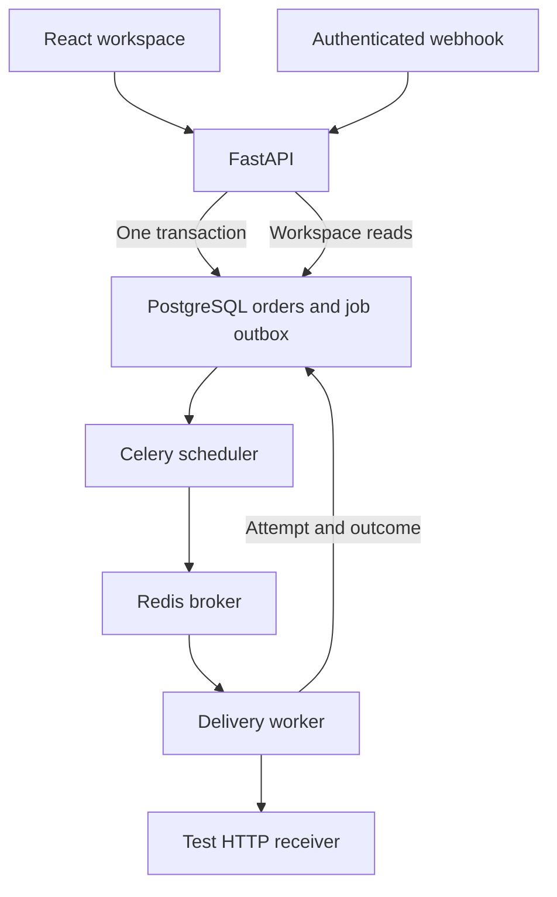

# Architecture

One Python service owns the business rules and database. React presents the workspace. Worker processes handle outbound delivery; a scheduler repeatedly scans durable jobs. Organisation IDs come from authenticated credentials, never from a client-selected tenant parameter.

## Order acceptance

A transaction inserts the order, its pending job and its audit event. Unique constraints apply to `(organisation, event_id)` and `(organisation, order_reference)`. Identical event retries return the original identifier; a reused identifier with different content is a conflict. Decimal input is converted to integer cents, stored as 64-bit database integers. Currency totals remain separate.

## Delivery guarantees

The job table doubles as the durable outbox. The dispatcher queues eligible jobs without deleting them or declaring them delivered. If the broker is unavailable, the next dispatch can recover. Repeated dispatch is expected.

An atomic conditional UPDATE claims a job and records a unique 120-second lease token. Competing tasks cannot claim a healthy active lease. An expired lease is eligible for recovery. Completion is conditional on the same token, preventing an old worker from replacing a newer claim's state.

The receiver must support idempotency keys to make repeated delivery safe. Delivery is at least once, not exactly once. The example receiver uses a persistent unique key and payload fingerprint to deduplicate after a response is lost. Arbitrary third-party receivers cannot inherit this guarantee without an appropriate adapter.

Timeouts, HTTP 408/429 and 5xx responses are transient. They retry with exponential backoff and a maximum of three attempts per recovery cycle. Other unsuccessful HTTP statuses are terminal. An operator may explicitly schedule three more attempts, while cumulative attempts and audit history remain visible. Redirects are not followed. The destination URL is operator deployment configuration, not arbitrary input from the browser.

## Reconciliation

The CSV header is fixed. The entire file is validated before inserts; invalid rows reject the import. A repeat payment reference with identical data is skipped. Conflicting data rejects the transaction. Exact order reference, amount and currency produce a match. Missing orders and unequal amounts/currencies produce exceptions. Manual matching also requires exact amount and currency.

This version treats each payment independently. It does not calculate partial settlements, overpayments, refund balances or the sum of several payments against an order.

## Authentication and permissions

Passwords use scrypt with a random salt. Session secrets are random, stored as hashes and expire after 12 hours. Browser cookies are HTTP-only and SameSite Strict; HTTPS deployment requires Secure cookies. State-changing browser endpoints require a custom request header and the application enables no cross-origin credential sharing. Integration keys are hashed, revocable and limited to inbound order submission.

Administrators manage members, keys and connector mode. Operators create orders, import/match payments and retry failed jobs. Viewers read workspace records. Every relevant query scopes data to the authenticated organisation.

## Deployment choices

The production build is served by FastAPI under the same origin. Compose supplies PostgreSQL and Redis with persistent volumes. The test destination uses its own SQLite database. Local development can use SQLite and a polling worker. A non-root container runs application processes.
